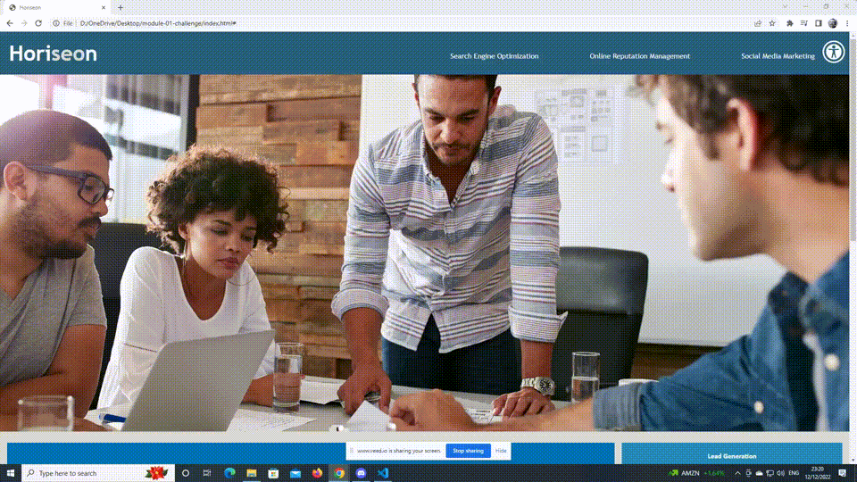

# Module 01 Challenge | Horiseon

  

 

## Description 

This project is a HTML webpage containing sample information about a marketing agency as part of a bootcamp challenge. The goal of the project is to introduce extra functionality via javascript/css in order to provide users with accesibility options following standard practices. This is done in order to optimize the website for search engines, making it appear as close as possible in the top of the results.

 

## Features

Currently the website has two features:

1. A toggle for dyslexia that when clicked on will change the font family and increase the size of the text making it easier to read.

2. A toggle for for people with ADHD, helping them keep track of where they are in the sentence/line. This was done by adding a horizontal bar at the cursor location. The user can then position the bar wherever they want on the page and read the text above or below it.

This website has also been made responsive and compatible to many different screen sizes with flexbox.

 

## Table of Contents

* [Installation](#installation)
* [Usage](#usage)
* [Contributing](#contributing)
* [Credits](#credits)
* [License](#license)

 

## Installation

Installation not required at the moment, since this is a "plug and play" type of application. The user can simply run it locally by clicking on the "index.html" file and opening in either their default or preferred browser.

 

## Usage 

The user can view accessiblity option by clicking on the relevant icon market by a "human" button found on the top right side of the webpage. 

After that, a panel will be shown on the right side with each option toggle. 

Toggling each of the panels will change the behaviour of the page according to the explanations in the description section of this README as can be seen below.

 

</img>

 

There is also extra front-end functionality in the form of a responsive layout that will fit content properly on page regardless of screen resolution or window size.

 

</img>

 

## Contributing

Please take a look at our contributing guidelines below if you're interested in helping!
1. Clone repo and create a new branch: $ git checkout https://github.com/YueHuaHua/module-01-challenge -b name_for_new_branch.
2. Make changes and test
3. Submit Pull Request with comprehensive description of changes.

 

## Credits

* Accessibility logo vector made by [Walter Moretti](https://www.pngitem.com/userpic/27070/) from [PNGitem](https://pngitem.com/)
* ADHD line's concpet is based on [DIV follows the cursor](https://codepen.io/lfry/pen/AEqKRM) concept by [Lindsay Fry](https://codepen.io/lfry)
* Toggle button is inspired from [Toggle Open Dyslexic](https://codepen.io/cornetespoir/pen/ppBLQa) tutorial by [Bridgette](https://codepen.io/cornetespoir/pen/ppBLQa)

 

## License

Licensed under the [MIT license](https://github.com/git/git-scm.com/blob/main/MIT-LICENSE.txt). See LICENSE for the full details.
